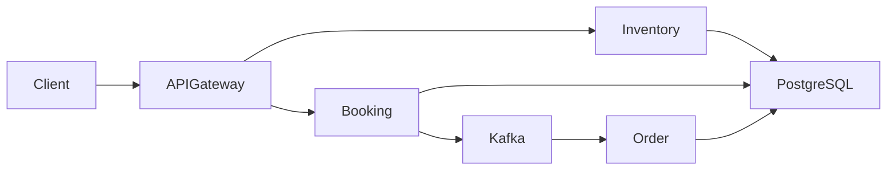
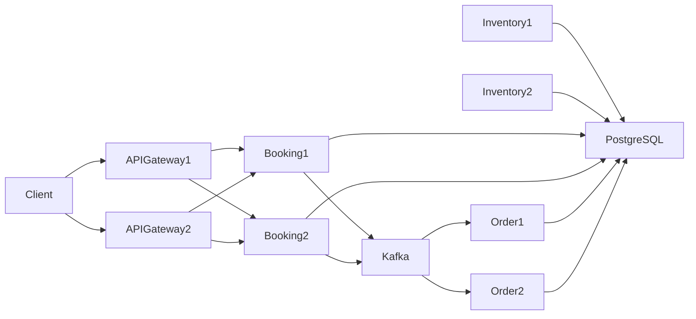

# Event Booking System

A scalable event-driven booking platform built using Spring Boot microservices, Kafka, Docker, Kubernetes, and Helm.

This project demonstrates:

- Microservices architecture
- Asynchronous communication using Kafka
- API Gateway pattern
- Kubernetes deployments with Helm
- Horizontal scalability
- Service-to-service communication
- Containerized deployment workflow

---

# Architecture Overview



---

# Services

## 1. Inventory Service

Responsible for:

- Venue management
- Event management
- Inventory availability

### APIs

```http
POST /api/v1/inventory/addVenue
POST /api/v1/inventory/addEvent

GET  /api/v1/inventory/event/{id}
GET  /api/v1/inventory/events
```

---

## 2. Booking Service

Responsible for:

- Handling booking requests
- Validating availability
- Publishing booking events to Kafka

### API

```http
POST /api/v1/booking
```

### Responsibilities

When a booking request is received:

1. Validates inventory availability
2. Creates booking entry
3. Publishes booking event asynchronously to Kafka

---

## 3. Order Service

Responsible for:

- Consuming booking events from Kafka
- Creating downstream order records asynchronously

This service demonstrates event-driven architecture and asynchronous processing.

---

## 4. API Gateway

Acts as:

- Single entry point for all client requests
- Request router for backend microservices

Example routes:

```http
/api/v1/inventory/**
/api/v1/booking/**
```

---

# Event-Driven Flow

```text
Client
   ↓
API Gateway
   ↓
Booking Service
   ↓
Kafka Topic
   ↓
Order Service
```

---

# Technology Stack

## Backend

- Java
- Spring Boot
- Spring Cloud Gateway
- Spring Data JPA

## Messaging

- Apache Kafka
- Zookeeper

## Database

- PostgreSQL

## DevOps / Infrastructure

- Docker
- Docker Compose
- Kubernetes
- Helm

---

# Key Features

- Microservices-based architecture
- Kafka-based asynchronous communication
- Horizontal scalability support
- Kubernetes-native deployment
- Helm-based one-command deployment
- Dockerized services
- Internal service discovery
- API Gateway pattern
- Event-driven workflow

---

# Horizontal Scaling Support

This project supports horizontal scaling for all core microservices:

- Inventory Service
- Booking Service
- Order Service
- API Gateway




Kubernetes replica scaling can be configured through Helm values.

Example:

```yaml
replicaCount: 3
```

This allows the system to:

- handle increased traffic
- distribute load
- improve fault tolerance
- scale services independently


---

# Run Locally Using Docker Compose

## Start All Services

```bash
docker-compose up --build
```

## Stop Services

```bash
docker-compose down
```

---

# Kubernetes Deployment Using Helm

## Install

```bash
helm install my-release event-booking-system-chart
```

## Upgrade

```bash
helm upgrade my-release event-booking-system-chart
```

## Uninstall

```bash
helm uninstall my-release
```

---

# Kubernetes Components

The Helm chart deploys:

- Inventory Service
- Booking Service
- Order Service
- API Gateway
- Kafka
- Zookeeper
- PostgreSQL

---

# Service Discovery

Services communicate internally using Kubernetes DNS.

Examples:

```text
inventory:8000
booking:8001
kafka-broker:9092
postgresql:5432
```

---

# Kafka Integration

Kafka is used to decouple services and enable asynchronous communication.

### Producer

- Booking Service

### Consumer

- Order Service

### Benefits

- Loose coupling
- Better scalability
- Improved resilience
- Asynchronous processing

---

# Docker Images

Docker images are published for all services.

Example:

```text
prateekwayne/inventory-service
prateekwayne/booking-service
prateekwayne/order-service
prateekwayne/apigateway-service
```

---

# Future Improvements

Planned enhancements:

- Distributed tracing
- Centralized logging
- Retry & Dead Letter Queue handling
- Prometheus + Grafana monitoring
- CI/CD pipeline
- Authentication & authorization
- Rate limiting
- Kubernetes Ingress support

---

# Learning Goals

This project was built to practice:

- Spring Boot microservices
- Event-driven architecture
- Kafka integration
- Docker containerization
- Kubernetes deployments
- Helm chart packaging
- Internal networking & service discovery
- Horizontal scaling concepts

---

# Author

Prateek Verma
